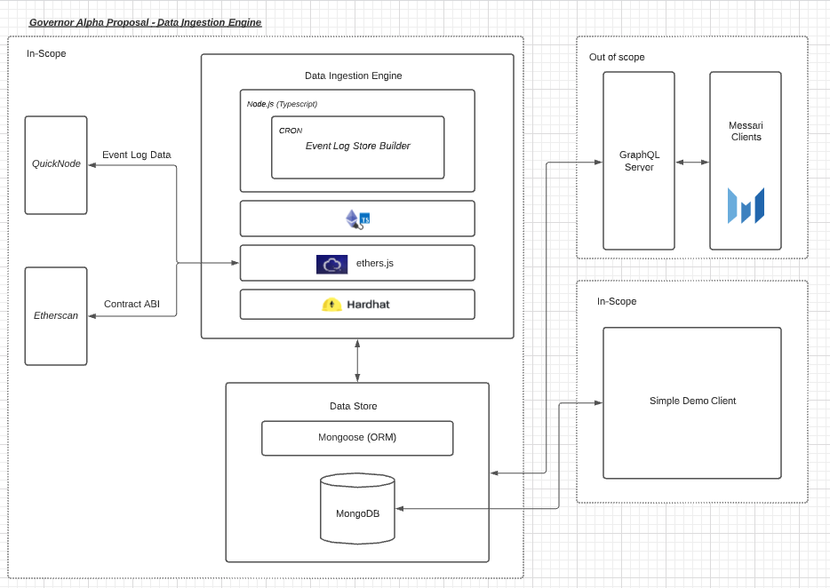

# Introduction

Messari-Hail-Mary is an implementation of a service which retrieves data from deployed smart contracts. The data in question represents "proposals" which are instantiated, stored and managed via a governance smart contract. 

The ultimate goal of the project is to collate and standardize data from several governance smart contracts (e.g. Governor Alpha, Governor Bravo) but as this remains a proof of concept, it currently only interacts with the Governor Alpha contract deployed to mainnet. 

## Data Retrieved

This service retrieves the following information from the deployed contract.

Proposal Data:

`interface GovernorAlphaProposal {
  id: BigNumber,
  proposer: string,
  targets: string[],
  signatures: string[],
  calldatas: string[],
  startBlock: BigNumber
  endBlock: BigNumber,
  description: string,
  proposalStates: ProposalState[]
}`

Historical State Data:

`interface ProposalState {
    state: String,
    blockExecuted: BigNumber
}`

## Tech Stack

The repository is built using Hardhat. Hardhat manages the applications interactions with on-chain data, abstracting away all info concerning API keys for services including etherscan, infura, alchemy, etc. 

Hardhat compiles and executes the program which is written in typescript. The repo also relies on types which are programatically generated by typechain. These generated types have been committed to the repo for convenience but may be updated at any time. 

Data is formatted and stored in the specified MongoDB instance. MongoDB was chosen for compatibility with JSON payloads and the fact that no relations exist (or are necessary) between data given that there is only one collection (or one table if a SQL approach was adopted).

An image of the tech stack can be found below. 



## Installation

Once you have cloned the git repo, setup is simple! All you need is `npm`, `node` and `MongoDB` in order to run the project locally. If you dont have those dependencies, you can download them using the following commands.

```bash
    brew install node
    
    brew install npm
    
    brew tap mongodb/brew
    brew install mongodb-community@5.0
```

NOTE: If you don't have homebrew install - please visit the following [link](https://docs.brew.sh/Installation)

Once you have the necessary dependencies, starting the application is as simple as running the two following commands.

```bash
    npm install
    npm start
```

## Usage

Data can be retrieved directly from the MongoDB instance specified once the process has run successfully. Enjoy exploring! 

## Contributing

Pull requests are welcome. For major changes, please open an issue first to 
discuss what you would like to change.

Please make sure to update tests as appropriate.

## License
[MIT](https://choosealicense.com/licenses/mit/)

# Hardhat Template Information

This project demonstrates a basic Hardhat use case and is based on the provided Hardhat template.

Try running some of the following tasks:

```shell
npx hardhat accounts
npx hardhat compile
npx hardhat clean
npx hardhat test
npx hardhat node
npx hardhat help
```
