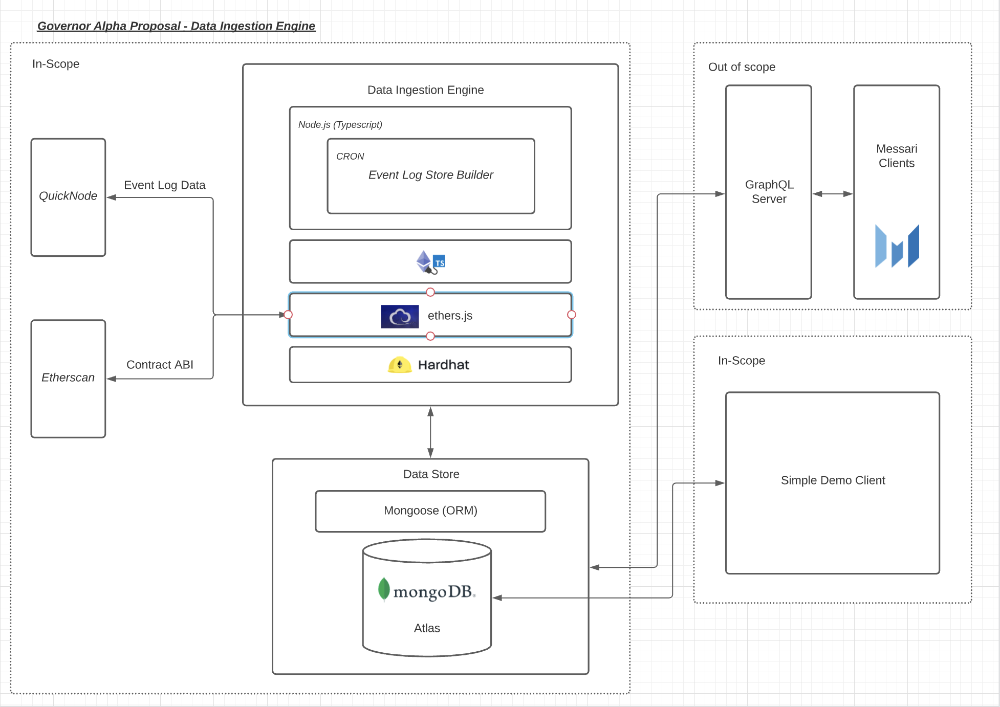

# Introduction

Messari-Hail-Mary is an implementation of a service which retrieves data from the Governor Alpha smart contract deployed to mainnet. The data in question represents "proposals" which are instantiated, stored and managed via the smart contract. 

The ultimate goal of the project is to collate and standardize data from several governance smart contract instances (e.g. Governor Alpha, Governor Bravo).  In its current state the repository only interacts with the Governor Alpha contract.

## Data Retrieved

This service retrieves all emitted event data from the deployed contract including: `ProposalCreated`, `ProposalExecuted`,`ProposalQueued` and `ProposalCancelled`. The `ProposalCreated` event contains sufficient data - as provided in the event constructor arguments - to create the following
useful slice of data to be consumed by an API service or view.  

Proposal Data:

`interface GovernorAlphaProposalModelType {
  id: number,
  proposer: string,
  targets: string[],
  signatures: string[],
  calldatas: string[],
  startBlock: number,
  endBlock: number,
  description: string,
  historicalStates: GovernorAlphaProposalHistoricalStatesModelType[]
}`

The `GovernorAlphaProposalHistoricalStatesModelType` data is slightly more tricky. The deployed contract dictates that proposals may be in the following states: `[ "PENDING", "ACTIVE", "CANCELED", "DEFEATED", "SUCCEEDED", "QUEUED", "EXPIRED", "EXECUTED" ]`. While there exists a fuction to query the current state of a proposal, the transition of proposals between states is not made available directly. Therefore the `ProposalExecuted`,`ProposalQueued` and `ProposalCancelled` events are required (in addition to some logical replication of the state machine) in order to build a representation of the 
proposal's state transition over time. Once processed and normalized, the data is persisted in the following format.

`interface GovernorAlphaProposalHistoricalStatesModelType {
  state: PROPOSAL_STATES,
  blockNumber: number,
}`

## Tech Stack

The application is built using Hardhat. Hardhat manages the applications interactions with on-chain data, abstracting away all info concerning API keys for services like etherscan, infura, alchemy, etc. 

Hardhat compiles and executes the application script which is written in Typescript. The repo also relies on types which are programatically generated from the smart contract ABI by Typechain. These generated types have been committed to the repo for convenience but may be updated at any time using the following command:

```bash
    npm run getABI
    npm run generateTypes
```

Data is formatted and stored in the specified MongoDB instance. MongoDB was chosen for compatibility with JSON payloads and the fact that no relations exist (or are necessary) between data given that there is only one collection (or one table if a SQL approach was adopted). In the production environment an instance of MongoDB Atlas is used.

An image of the tech stack can be found below. 



## Installation

Once you have cloned the git repo, setup is simple! All you need is `npm`, `node` and `MongoDB` in order to run the project locally. If you dont have those dependencies, you can download them using the following commands.

```bash
    brew install node
    
    brew install npm
    
    brew tap mongodb/brew
    brew install mongodb-community@5.0
```

NOTE: If you don't have homebrew install - please visit the following [link](https://docs.brew.sh/Installation)

## Usage

Once you have the necessary dependencies, starting the application is as simple as running the two following commands. Data can be retrieved directly from the MongoDB instance specified once the process has run successfully. Enjoy exploring! 

This will run the process a single time and then exit.

```bash
    npm install
    npm run start
```

Or you can run the process as a service.

```bash
    npm run service
```

## Logging

Logs are generated by winston and stored in the `logs` directory. Please feel free to take a look at the logs once you have
completed the service.

## Contributing

Pull requests are welcome. For major changes, please open an issue first to discuss what you would like to change.

Please make sure to update tests as appropriate.

## License
[MIT](https://choosealicense.com/licenses/mit/)

# Hardhat Template Information

This project demonstrates a basic Hardhat use case and is based on the provided Hardhat template.

Try running some of the following tasks:

```shell
npx hardhat accounts
npx hardhat compile
npx hardhat clean
npx hardhat test
npx hardhat node
npx hardhat help
```
